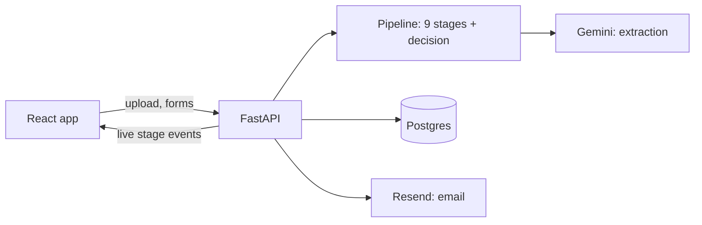

# InvoiceIQ

InvoiceIQ is an accounts-payable assistant built for the Zamp AI Solutions Associate case study (PS-1). Upload a vendor invoice PDF, text or scanned, and watch it move through nine checks live: an LLM reads the fields, then Python rules verify the vendor, match the purchase order, check amounts, duplicates, GST and payment terms, and end with an explainable **Approve / Hold / Reject** decision and routed email alerts.

**Live:** https://invoiceiq-kxv1.onrender.com — start with the tour on the **Process** page.

## What it does

**The 9 checks**

1. **Read document:** text or scanned PDF; rejects quotations and non-invoices.
2. **Extract fields:** vendor, invoice number, date, lines, tax, totals, bank, each with a confidence level.
3. **Completeness and maths:** required fields present, not future-dated; lines, tax and totals add up.
4. **Verify vendor:** known, active, not blocked; GSTIN and bank account match the vendor master.
5. **Match PO:** explicit reference, or inferred by filtering and scoring the vendor's open POs.
6. **Amounts and quantities:** within tolerance and within the PO's remaining balance and quantity.
7. **Duplicates:** catches resubmissions, even with a reformatted invoice number or a re-scan.
8. **Tax:** GST rate valid for the date; CGST+SGST vs IGST split correct for the states involved.
9. **Dates and terms:** invoice not too old; due date from PO terms, capped at 45 days for MSME vendors.

**3 decisions:** any Reject → **Reject**; else any Hold → **Hold** (goes to the review queue); else **Approve** with payee, amount and due date.

**Alert routing:** vendor mistakes go to the **vendor**; our-side problems (missing PO, blocked vendor) go to **Procurement**; fraud signals (changed bank account, GSTIN mismatch) go to **Finance** and AP. Fraud alerts are **never** emailed to the vendor, because the contact on the invoice may be the fraudster.

**Vendor response link:** a vendor email carries a secure, expiring link where the vendor uploads a corrected invoice. It re-runs automatically, linked to the original: held → vendor responded → approved.

## Design principles

- **AI reads, rules decide.** The LLM only extracts fields and scores text similarity. Every decision is a Python rule with a case code and evidence.
- **At most 2 LLM calls per invoice**, cached by file hash, with a graceful fallback. An LLM error never crashes a run.
- **Money in integer paise.** No floats; shown as ₹ with Indian grouping (₹1,18,000).
- **Ambiguity always goes to a person.** Missing values stay null with a finding, never guessed. A wrong confident decision is worse than a Hold.
- **Segregation of duties by role.** Procurement creates POs and vendors, AP processes invoices, only Finance can clear fraud Holds.

## Architecture



| Layer | Choice |
| --- | --- |
| Frontend | React + Vite + TypeScript, Tailwind, shadcn/ui, Framer Motion, Recharts, TanStack Query |
| Backend | FastAPI, SQLAlchemy 2 |
| Database | SQLite locally, Postgres (Neon) live |
| AI | Google Gemini (google-genai) for extraction and description matching |
| PDF | pdfplumber (text), pypdfium2 (scans to images) |
| Matching | rapidfuzz |
| Email | Resend |
| Hosting | Render, one Docker service; FastAPI serves the React build |

Full design: [docs/InvoiceIQ_Solution_Design_PS1.md](docs/InvoiceIQ_Solution_Design_PS1.md). Build guide: [docs/InvoiceIQ_Build_Guide.md](docs/InvoiceIQ_Build_Guide.md).

## Assumptions

- **India/GST first.** The buyer is in Hyderabad, Telangana; GST is fully validated. Other countries use tax rates declared on the PO.
- **The Create PO form stands in for the ERP.** POs are never extracted from PDFs; reference data must be exact.
- **Two-way match** (invoice vs PO); no goods receipts.
- **Tolerance is ±2%, capped at ₹5,000.** Over tolerance is a Hold, not a Reject.
- Only approved invoices consume a PO's balance.

## The 10 samples

In `backend/samples/`; expected results in `backend/samples/expected.json`.

| File | Scenario | Expected |
| --- | --- | --- |
| `01_happy_deccan.pdf` | Clean text PDF, explicit PO, same-state GST; MSME due date capped at 45 days | Approve |
| `02_happy_brighttech_scan.pdf` | Scanned PDF, PO written as "PO 105", inter-state IGST | Approve |
| `03_edge_inferred_po_acme.pdf` | No PO reference; line-item scoring picks the right PO out of three | Approve |
| `04_edge_split_overbill_acme.pdf` | Third invoice on a PO; exceeds remaining balance and quantity | Hold |
| `05_edge_duplicate_sahyadri_scan.pdf` | Re-scan of an approved invoice, number rewritten as "42" | Reject |
| `06_edge_bank_changed_brighttech.pdf` | Bank account differs from vendor master (fraud signal, Finance only) | Hold |
| `07_extra_quotation_acme.pdf` | A quotation, not an invoice | Reject |
| `08_extra_wrong_split_brighttech.pdf` | Inter-state vendor billing CGST+SGST instead of IGST | Hold |
| `09_extra_missing_date_deccan.pdf` | No invoice date; demos the vendor response link | Hold |
| `10_extra_blocked_quickfix.pdf` | Blocked vendor quoting a PO that doesn't exist | Reject |

## Run locally

Needs Python 3.11 and Node 20.19+.

```bash
cp .env.example .env          # SQLite works as is; samples run offline from cached extractions

# backend, http://localhost:8000 (creates tables and seeds demo data on first start)
cd backend
python3 -m venv .venv && source .venv/bin/activate
pip install -r requirements-dev.txt
uvicorn app.main:app --reload

# frontend, second terminal, http://localhost:5173 (proxies /api to :8000)
cd frontend
npm install
npm run dev
```

**.env keys:** `DATABASE_URL`, `GEMINI_API_KEY`, `GEMINI_MODEL`, `GEMINI_MODEL_FALLBACK`, `RESEND_API_KEY`, `EMAIL_FROM`, `OWNER_EMAIL`, `BASE_URL`, `MAX_RUNS_PER_DAY`, `VENDOR_AUTO_SEND`, `SEND_EMAILS`, `MIN_STAGE_MS`. API keys are only needed for new PDFs and real emails. All emails go to `OWNER_EMAIL`; the intended recipient is stored.

**Tests**, from `backend/`:

```bash
pytest -q                                              # full suite, offline
python scripts/run_cli.py samples/01_happy_deccan.pdf  # one sample in the terminal
```

## What I'd build next

1. **Investigator agent on held invoices:** gathers evidence (vendor history, similar invoices, PO changes) and drafts a recommendation for the reviewer; rules still decide.
2. **Inbound email parsing:** read invoices straight from the AP mailbox.
3. **Scheduled reminders:** chase vendors and reviewers automatically when items sit waiting.
4. **ERP connectors (SAP, Tally)** in place of the Create PO form.
5. **More tax models:** UK VAT, US sales tax, or a tax engine behind the same interface.
