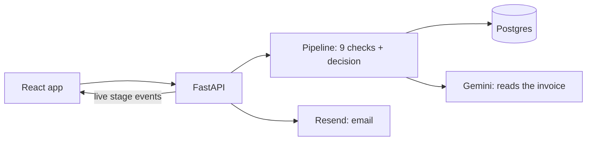

# InvoiceIQ

InvoiceIQ is an accounts-payable assistant built for the Zamp AI Solutions Associate case study (PS-1). You upload a vendor invoice PDF, text or scanned, and watch it go through nine checks live. An LLM reads the fields. Python rules then verify the vendor, match the purchase order, and check amounts, duplicates, GST and payment terms. Each invoice ends with an **Approve**, **Hold** or **Reject** decision that explains itself, and alerts go to the right people.

**Live:** https://invoiceiq-kxv1.onrender.com
**Start with the 3-minute tour on the Process page.** For the design in pictures, see [How it works](https://invoiceiq-kxv1.onrender.com/how-it-works).

## What it does

**The 9 checks**

1. **Read document:** text or scanned PDF; rejects quotations and non-invoices.
2. **Extract fields:** vendor, invoice number, date, lines, tax, totals and bank details, each with a confidence level.
3. **Completeness and maths:** required fields are present and the date isn't in the future; lines, tax and totals add up.
4. **Verify vendor:** known, active and not blocked; GSTIN and bank account match the vendor master.
5. **Match PO:** uses the printed PO reference, or infers the PO by filtering and scoring the vendor's open POs.
6. **Amounts and quantities:** within tolerance, and within the PO's remaining balance and quantity.
7. **Duplicates:** catches resubmissions, even with a reformatted invoice number or a re-scan.
8. **Tax:** GST rate valid for the date; CGST+SGST or IGST split correct for the states involved.
9. **Dates and terms:** invoice not too old; due date from the PO terms, capped at 45 days for MSME vendors.

**3 decisions:** any Reject finding → **Reject**. Otherwise any Hold finding → **Hold**, which goes to the review queue. Otherwise → **Approve**, with payee, amount and due date.

**Alert routing:** vendor mistakes go to the **vendor**. Problems on our side, such as a missing PO or a blocked vendor, go to **Procurement**. Fraud signals, such as a changed bank account or a GSTIN mismatch, go to **Finance** and AP. Fraud alerts are **never** emailed to the vendor, because the contact on the invoice may be the fraudster.

**Human review:** every Hold waits in a review queue with its evidence. A reviewer can correct fields, pick the right PO, override, reject, or send the invoice back to the vendor. Every action is logged with before and after values.

**Vendor response link:** the email to a vendor carries a secure link that expires. On that page the vendor uploads a corrected invoice, which re-runs automatically and stays linked to the original: held → vendor responded → approved. AP can also upload a corrected invoice from the review page.

**Multi-invoice PDFs:** one PDF holding several invoices is split into one run per invoice. Pages are assigned only on evidence, never guessed; if the pages can't be assigned with certainty, the file is held. If any invoice in the file carries a fraud signal, the other invoices from that file are held for Finance too. A tampered bank account on one page means nothing in that file can be trusted.

## Design principles

- **AI reads, rules decide.** The LLM only extracts fields and scores text similarity. Every decision is a Python rule with a case code and evidence.
- **At most 2 LLM calls per invoice**, cached by file hash, with a graceful fallback. An LLM error never crashes a run.
- **Money in integer paise.** No floats; amounts show as ₹ with Indian grouping (₹1,18,000).
- **Ambiguity always goes to a person.** Missing values stay null with a finding and are never guessed. A confident wrong decision is worse than a Hold.
- **Segregation of duties by role.** Procurement creates POs and vendors, AP processes invoices, and only Finance can clear fraud Holds or change the tolerance.

## Safeguards

- **Grounding check:** on a text PDF, the invoice number, GSTIN, bank account and total the AI read must be printed in the document. A value that isn't found is held for a person to confirm.
- **PO locked during approval:** the PO is locked while an approval commits, so two approvals can't both spend the same balance.
- **Override past the PO balance** needs an explicit confirmation from the reviewer.
- **Bank numbers masked** to the last 4 digits, except for Finance on an invoice held for fraud.
- **Public vendor link rate-limited:** 5 requests per link and 20 per IP address per hour.
- **Daily cap counts only AI runs:** only new files the AI has to read count towards `MAX_RUNS_PER_DAY`; cached samples and re-runs don't.

## Architecture



| Layer | Choice |
| --- | --- |
| Frontend | React + Vite + TypeScript, Tailwind, shadcn/ui, Framer Motion, Recharts, TanStack Query |
| Backend | FastAPI, SQLAlchemy 2 |
| Database | SQLite locally, Postgres (Neon) live |
| AI | Google Gemini (google-genai) for extraction and description matching |
| PDF | pdfplumber (text), pypdfium2 (scans to images) |
| Matching | rapidfuzz |
| Email | Resend |
| Hosting | Render, one Docker service; FastAPI serves the React build |

Full design: [docs/InvoiceIQ_Solution_Design_PS1.md](docs/InvoiceIQ_Solution_Design_PS1.md). Build guide: [docs/InvoiceIQ_Build_Guide.md](docs/InvoiceIQ_Build_Guide.md).

## Assumptions

- **India/GST first.** The buyer is in Hyderabad, Telangana, and GST is fully validated. Other countries use the tax rates declared on the PO.
- **The Create PO form stands in for the ERP.** POs are never extracted from PDFs, so reference data is exact.
- **Two-way match:** invoice against PO; no goods receipts.
- **Tolerance is ±2%, capped at ₹5,000.** Going over tolerance is a Hold, not a Reject.
- **Roles are a selector for the demo**, not real logins (see Known limitations).

## The 10 samples

In `backend/samples/`; expected results in `backend/samples/expected.json`.

| File | Scenario | Expected |
| --- | --- | --- |
| `01_happy_deccan.pdf` | Clean text PDF, explicit PO, same-state GST; MSME due date capped at 45 days | Approve |
| `02_happy_brighttech_scan.pdf` | Scanned PDF, PO written as "PO 105", inter-state IGST | Approve |
| `03_edge_inferred_po_acme.pdf` | No PO reference; line-item scoring picks the right PO out of three | Approve |
| `04_edge_split_overbill_acme.pdf` | Third invoice on a PO; exceeds remaining balance and quantity | Hold |
| `05_edge_duplicate_sahyadri_scan.pdf` | Re-scan of an approved invoice, number rewritten as "42" | Reject |
| `06_edge_bank_changed_brighttech.pdf` | Bank account differs from vendor master (fraud signal, Finance only) | Hold |
| `07_extra_quotation_acme.pdf` | A quotation, not an invoice | Reject |
| `08_extra_wrong_split_brighttech.pdf` | Inter-state vendor billing CGST+SGST instead of IGST | Hold |
| `09_extra_missing_date_deccan.pdf` | No invoice date; demos the vendor response link | Hold |
| `10_extra_blocked_quickfix.pdf` | Blocked vendor quoting a PO that doesn't exist | Reject |

## Testing

- **412 automated tests** (`pytest -q` from `backend/`), all offline: rules, money, GSTIN, PO matching and balances, extraction and grounding, alerts, review actions, the vendor link, PDF splitting, hardening and the API.
- **In-app Tests page:** runs all 10 samples against a fresh copy of the seed data and shows expected against actual. The result is **10/10**. It never touches live runs, alerts, POs or the daily cap.

## Run locally

Needs Python 3.11 and Node 20.19+.

```bash
cp .env.example .env          # SQLite works as is; samples run offline from cached extractions

# backend, http://localhost:8000 (creates tables and seeds demo data on first start)
cd backend
python3 -m venv .venv && source .venv/bin/activate
pip install -r requirements-dev.txt
uvicorn app.main:app --reload

# frontend, second terminal, http://localhost:5173 (proxies /api to :8000)
cd frontend
npm install
npm run dev
```

**.env keys:** `DATABASE_URL`, `GEMINI_API_KEY`, `GEMINI_MODEL`, `GEMINI_MODEL_FALLBACK`, `RESEND_API_KEY`, `EMAIL_FROM`, `OWNER_EMAIL`, `BASE_URL`, `MAX_RUNS_PER_DAY`, `VENDOR_AUTO_SEND`, `SEND_EMAILS`, `MIN_STAGE_MS`. You only need the API keys for new PDFs and real emails. All emails go to `OWNER_EMAIL`, and the intended recipient is stored.

**Tests**, from `backend/`:

```bash
pytest -q                                              # full suite, offline
python scripts/run_cli.py samples/01_happy_deccan.pdf  # one sample in the terminal
```

## Known limitations and path to production

This is a pilot. Each line is a gap today, then the fix.

- **Identity:** the role picker is a header anyone can set → real logins with SSO (Google Workspace / Entra ID) and roles resolved on the server from the signed-in user.
- **GSTIN checks:** format and checksum only → check the GSTIN is active, and verify e-invoice IRNs and signed QR codes, through a GSP / the IRP.
- **Email:** everything goes to one owner inbox from a shared sender → our own domain with SPF, DKIM and DMARC, real vendor and team addresses, and inbound email so invoices and vendor replies arrive by mail.
- **ERP:** vendors, POs and approvals live only in InvoiceIQ → connectors to SAP and Tally for master data in and approved invoices out.
- **Scope of invoices:** PO-backed INR invoices, two-way match → non-PO spend, foreign currency, TDS, reverse charge, credit notes, and three-way match against goods receipts.
- **Hosting:** free tier that sleeps, pipeline in in-process background tasks, in-memory rate limits → always-on hosting, a job queue with workers and retries, shared rate limiting, automated backups and restore drills, monitoring and alerting.
- **Security:** bank numbers stored in clear, audit trail in ordinary tables → a security review and penetration test, field-level encryption of bank data, and an append-only (immutable) audit log.
- **Data protection:** no formal privacy basis yet → DPDP Act compliance (notice, purpose limits, retention, breach process) and a data processing agreement with the AI provider (no training on our data, region and retention agreed).
- **Accuracy:** measured on 10 samples → accuracy and exception rates measured on real invoice volume, with a labelled set and a regular review of misses.

## What I'd build next

1. **Investigator agent on held invoices:** gathers evidence (vendor history, similar invoices, PO changes) and drafts a recommendation for the reviewer; rules still decide.
2. **Three-way match with goods received:** check what was invoiced against what arrived, not only against what was ordered.
3. **Learning from reviewer decisions:** use how reviewers resolve Holds to tune matching and reduce repeat Holds, with every change still a visible rule.
4. **Payment file:** export approved invoices as a bank payment file, paid on their due dates.
5. **Invoices from the AP mailbox:** read invoices straight from inbound email instead of uploads.
