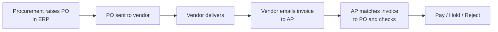
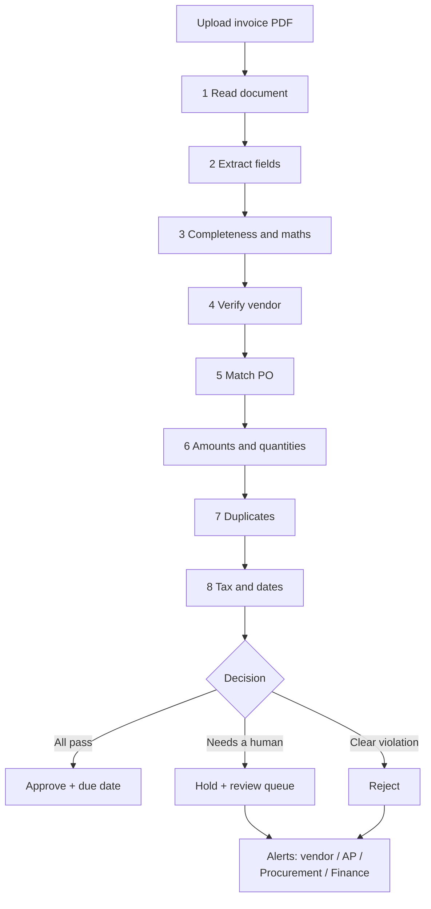
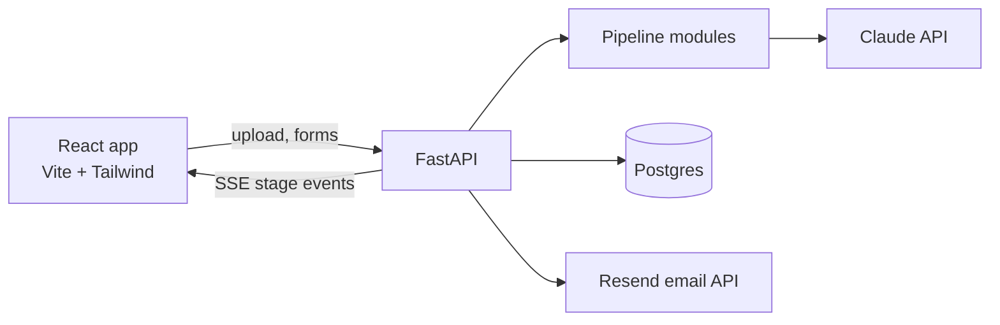
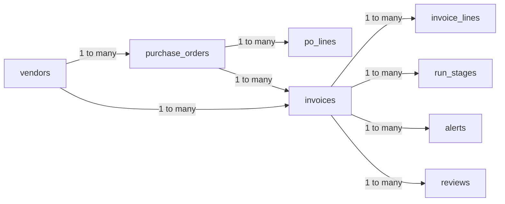
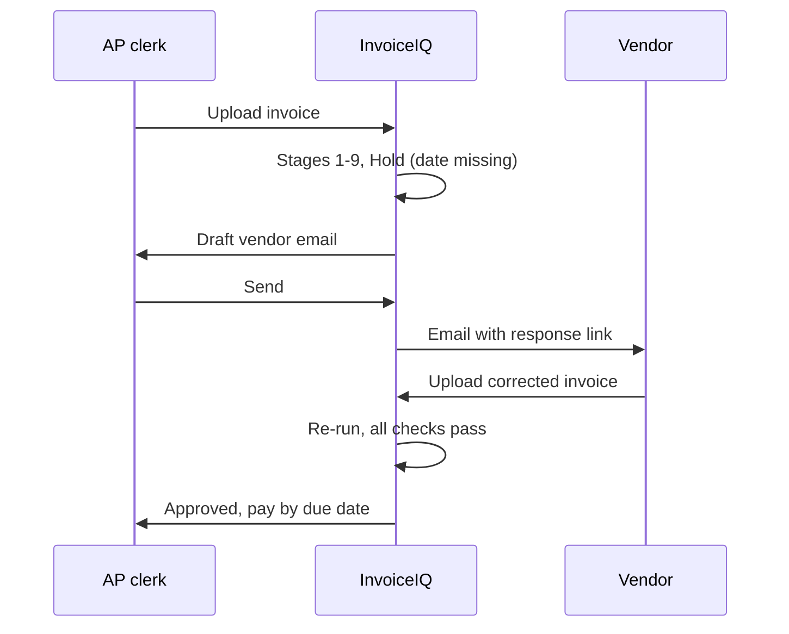

# InvoiceIQ — Invoice Processing Solution Design (Zamp PS-1)

24 Sep 2026 · Nallam Venkat Mani Shankar

## Executive summary

InvoiceIQ is a hosted web app that turns a vendor invoice PDF into a reasoned **Approve / Hold / Reject** decision, with every step visible as it runs.

An AP clerk uploads an invoice. The process reads it (text or scanned), matches it to the company's purchase orders, handles 62 cases across vendor, amounts, duplicates, tax and dates, and decides. Anything uncertain goes to a human review queue. Anything the vendor must fix triggers an email to the vendor; anything on the company's side alerts the right internal team; fraud signals go to Finance only.

The core design principle: **AI reads and compares, rules decide.** Every decision traces back to named checks with evidence, which is what makes it acceptable to finance teams.

| Item | Choice |
| --- | --- |
| Problem statement | Zamp ASA case study, PS-1: Invoice processing, PDF to decision |
| Build window | 48 hours, end to end |
| Stack | FastAPI (Python) + React, Claude API, Postgres, hosted on Render |
| Deliverables | Live hosted app + 5-minute demo video; live demo in interview |
| Showcase edge cases | Inferred PO match, split invoicing over balance, disguised duplicate, changed bank account |

## The business problem

A mid-size company receives hundreds of vendor invoices a month by email, and an AP clerk checks each one by hand against the purchase orders before paying. The work is repetitive and slow, and a tired person makes expensive mistakes.

### Today's manual workflow

1. A vendor emails an invoice PDF to the AP team.
2. The clerk opens it and reads vendor, invoice number, date, amounts and PO number.
3. The clerk finds the matching PO in a spreadsheet or ERP.
4. The clerk checks the invoice agrees with the PO: right vendor, items, quantities, prices, tax.
5. The clerk decides to pay, query the vendor, or reject, and chases the vendor by email if something is missing.

### Why it is hard

**The invoices are messy.** Every vendor uses its own format. Some PDFs have text; some are scans or photos. Line items may be itemised or bundled into one line. Tax may be shown separately or included in prices. The PO reference may be printed clearly, written oddly ("PO118", "Ref 2026/118"), buried in notes, or missing. Critical fields such as invoice number, date or total are sometimes absent.

**The rules are real.** Procurement has approved vendors, PO amounts, tolerance thresholds and duplicate rules. One PO may be billed across several invoices, so the invoice must be checked against the PO's *remaining balance*, not its total. Amounts can be close but not exact.

**Matching needs judgment.** Without a PO reference, the clerk must work out which PO an invoice belongs to, and sometimes two POs look plausible.

### What errors cost

| Error | Consequence |
| --- | --- |
| Paying a duplicate | Money paid twice, hard to recover |
| Paying above the PO | Overspend against budget |
| Paying to a changed bank account | Payment fraud; money usually lost |
| Wrong GST split or rate | Company can't claim input tax credit; invoice must be reissued |
| Matching to the wrong PO | Wrong budget charged; that PO's balance is wrong for every future invoice |
| Slow or no vendor follow-up | Late payments, damaged vendor relationships |

### What the solution must do

Take an invoice as input and produce a clear, reasoned decision, with everything in between visible: what was extracted, which checks passed or failed, and why. It must handle real, messy inputs, deal with edge cases gracefully, and be explainable to a non-technical finance buyer.

## Key concepts

The PO is the company's own trusted record; the invoice is an untrusted claim from outside. Everything else follows from that.

| Concept | Plain meaning |
| --- | --- |
| Purchase Order (PO) | Created by the company's procurement team and sent to the vendor: "we will buy this, at this price, up to this amount". Born as structured data in the ERP. |
| Invoice | Created by the vendor and sent to AP: "we delivered, pay us this". Arrives as a PDF in any format. |
| Two-way match | Checking invoice against PO. (Three-way match adds a goods receipt; out of scope.) |
| Remaining balance | PO total minus already-approved invoices on that PO. Split invoices are checked against this. |
| Tolerance | How close is close enough: ±2%, capped at ₹5,000. |
| GST | India's tax on goods and services, added by the vendor on top of the price. Main slabs since 22 Sep 2025: 0%, 5%, 18%, 40% (12% and 28% discontinued). |
| CGST + SGST | GST split in half between centre and state when vendor and buyer are in the same state. |
| IGST | Full GST in one line when vendor and buyer are in different states; the centre passes the state share to the buyer's state (destination-based). |
| GSTIN | 15-character GST ID. First 2 digits = state code; characters 3–12 = PAN. |
| Input tax credit | Businesses reclaim GST paid on purchases, but only if the invoice is correct. Why AP checks tax. |
| Payment terms | Days allowed to pay, e.g. Net 30 = due 30 days after invoice date. Can be 60, 90, 120+. MSME vendors must be paid within 45 days by law. |
| Non-PO invoice | Spend without a PO (rent, utilities, subscriptions); goes to manager approval, not PO matching. |
| Import | Foreign vendor invoices carry no Indian GST. Goods: buyer pays customs duty + IGST at the port (Bill of Entry). Services: buyer pays IGST itself under reverse charge. |

### Who creates what



POs are the trusted, structured side; invoices are the messy, untrusted side. The process turns the messy side into structured data and checks it against the trusted side.

## Users, scope and assumptions

The build covers an Indian company with Indian vendors end to end; other countries and advanced controls are designed for and explained, not all built.

### Users

| Role | Does | Why separated |
| --- | --- | --- |
| Procurement | Creates POs, adds vendors | PO creation is a fraud vector: whoever raises a PO must not approve invoices against it (segregation of duties) |
| AP clerk | Processes invoices, reviews Holds, sends vendor emails | Owns the payment decision |
| Finance | Clears fraud Holds (bank account changes, impersonation) | Highest-risk decisions need a senior owner |

For the build these are a role selector, not real logins; every PO and decision records who did it.

### Scope

| Build now | Built last if time allows | Explain in interview only |
| --- | --- | --- |
| Indian company, INR, GST fully validated | Other countries with user-declared tax rates | UK VAT / US sales tax modules; tax engines such as Avalara |
| Multi-stage pipeline, 62 handled cases | Role selector | Customs bills and reverse-charge accounting |
| Happy path + 4 showcase edge cases | Vendor response link (upload corrected invoice) | Three-way matching with goods receipts |
| Live run view, dashboard, review queue | Approve/reject from email links | Real SSO with company domain |
| PO register, Create PO, Add vendor | PDF splitting for multi-invoice files | Sanctions screening, MSME limits |
| Alerts and Outbox, reset demo data, hosting | Foreign-vendor zero-tax rule | ERP integration instead of the PO form |

### Assumptions

1. The buying company is in India (Hyderabad, Telangana, state code 36); vendors are Indian unless marked otherwise.
2. Currency is INR; matching is always done in the PO's currency.
3. Two-way match only (invoice vs PO).
4. POs come from the company's ERP; the Create PO form stands in for it. POs are never extracted from PDFs, because the reference data must be exact.
5. Tolerance is ±2% of the amount, capped at ₹5,000.
6. Only approved invoices consume a PO's balance.
7. A wrong confident decision is worse than a Hold, so ambiguity always goes to a human.
8. Tax rates are configuration (a table), not code.
9. Open question sent to the hiring coordinator: India-based setup, or US (USD, sales tax)? Building India meanwhile, with tax as a separate module.

## Solution overview

An invoice goes through 9 checking stages (tax and dates share a box below), then a decision, then alerts; each stage streams to the screen as it finishes.



### Design principles

1. **AI reads, rules decide.** Claude extracts fields from messy PDFs and compares item descriptions. Approving payment is done by explicit rules, so every decision is repeatable and auditable.
2. **Know what you don't know.** Every extracted field has a confidence level. Missing or unclear data is flagged, never guessed. Inferred matches are labelled as inferred.
3. **Run every check, then decide.** The pipeline doesn't stop at the first problem, so the vendor gets one email listing every issue.
4. **Hold beats a wrong decision.** Ambiguity goes to a human with the evidence side by side.
5. **Route alerts to whoever owns the problem.** Vendor mistakes to the vendor, our mistakes to our team, fraud to Finance only.
6. **Everything visible.** Each stage shows its outcome and evidence live; every run, correction and email is kept for audit.
7. **Configuration over code.** Tax rates, tolerance and company country live in tables and settings.

### Where AI is and isn't used

| Task | Tool | Why |
| --- | --- | --- |
| Classify document (invoice, quote, credit note) | Claude | Judgment on messy layouts |
| Extract fields, text or scanned | Claude (vision for scans) | No fixed template across vendors |
| Find invoice boundaries in multi-invoice PDFs | Claude | Layout understanding |
| Compare item descriptions to PO lines | Claude | "ErgoPro Mesh Chair" vs "Ergonomic office chair, mesh back" |
| Draft vendor and internal emails | Claude | Clear, specific, polite messages |
| Maths, balances, tolerance, duplicates, tax, dates | Rules (Python) | Must be exact and explainable |
| Final decision | Rules | Auditable; never a model's opinion |

## Architecture and tech stack

One hosted service: FastAPI runs the pipeline and serves the React app, streaming each stage to the browser over Server-Sent Events.



| Layer | Choice | Why |
| --- | --- | --- |
| Frontend | React (Vite), Tailwind, shadcn/ui, Framer Motion, Recharts | Product-grade UI; animated stage timeline; dashboard charts |
| Backend | FastAPI (Python) | Pipeline stays in Python; async streaming built in |
| Live updates | Server-Sent Events | Each stage pushes `{stage, status, message, details}` as it completes |
| AI | Claude API | Extraction (text and vision), classification, description matching, email drafting |
| PDF | pdfplumber (text), pypdfium2 (render scans to images) | Cheap text path first, vision only when needed |
| Database | SQLite locally, Postgres in production (Neon or Supabase), via SQLAlchemy | Free hosting wipes disks on restart; Postgres keeps dashboard history |
| Email | Resend (free tier) | Real emails to demo inboxes; inbound possible later |
| Hosting | Render, one service | One URL; FastAPI serves the built React files |

### Project structure

```
invoice-agent/
├── backend/
│   ├── main.py            # FastAPI app, routes, serves frontend
│   ├── db.py              # models + connection
│   ├── seed.py            # seed data + reset demo data
│   ├── alerts.py          # email drafting, routing, sending
│   ├── tax/
│   │   ├── india_gst.py   # validated GST model
│   │   └── manual.py      # user-declared rates, other countries
│   ├── pipeline/
│   │   ├── read.py        # file checks, text vs scan, doc type, splitting
│   │   ├── extract.py     # Claude extraction with confidence
│   │   ├── validate.py    # completeness and maths
│   │   ├── vendor.py      # GSTIN, status, bank account
│   │   ├── po_match.py    # explicit, filters, scoring
│   │   ├── amounts.py     # lines, balance, tolerance
│   │   ├── duplicates.py
│   │   ├── tax_dates.py
│   │   └── decide.py      # decision + alert grouping
│   └── data/seed/
├── frontend/src/pages/    # ProcessInvoice, Review, Dashboard, POs, Vendors, Outbox, Settings
└── samples/               # test invoice PDFs
```

Each stage is a function returning `status` (pass / warn / fail), a one-line `message` and `details` (the evidence). The run keeps a status (`running`, `needs_review`, `waiting_on_vendor`, `approved`, `held`, `rejected`), so a paused run can resume from the stage where it stopped.

## Data model

Nine tables plus company settings; anything derivable is calculated on read, never stored, so it can't go stale.

| Table | Columns | Purpose |
| --- | --- | --- |
| `company_settings` | name, country, gstin, state_code, currency, tolerance_pct, tolerance_abs, ap_email, procurement_email, finance_email, vendor_auto_send | The buying company and alert addresses |
| `vendors` | vendor_id, name, country, currency, tax_id (GSTIN), bank_account, ifsc_or_swift, contact_email, msme, status (Active/Blocked), created_by, created_at | Approved vendor master |
| `tax_rates` | country, tax_name, rate, label, valid_from, valid_to | GST slabs incl. discontinued 12%/28% with end date 21 Sep 2025 |
| `purchase_orders` | po_id, vendor_id, po_date, currency, payment_terms_days, department, status (Open/Closed/Cancelled), created_by, created_at | PO headers |
| `po_lines` | po_id, line_no, description, hsn_code, qty, unit, unit_price, tax_rate | What was ordered |
| `invoices` | run_id, parent_upload_id, file_name, file_hash, doc_type, status, invoice_no, invoice_no_normalised, invoice_date, vendor_tax_id, vendor_id, po_id, po_match_type (Explicit/Inferred/None), match_confidence, subtotal, cgst, sgst, igst, total, bank_account, decision, decision_reasons, due_date, processed_by, processed_at | One row per processed invoice; the ledger |
| `invoice_lines` | run_id, line_no, description, qty, unit, unit_price, tax_rate, matched_po_line | Invoice items |
| `run_stages` | run_id, stage_order, stage_name, status, message, details (JSON), duration_ms | Live run view and audit trail |
| `reviews` | run_id, reviewer, action (Confirm/SendToVendor/Reject/Override), reason, field_changes (JSON), created_at | Every human correction and override |
| `alerts` | alert_id, run_id, audience (Vendor/AP/Procurement/Finance), to, subject, body, status (Drafted/Sent), response_token, token_expires, sent_at | Outbox and vendor response links |

### Calculated, never stored

- PO subtotal, tax and total: from `po_lines`
- PO invoiced amount: sum of approved invoices on that PO
- PO remaining balance: total minus invoiced
- Vendor state code and PAN: from the GSTIN
- Expected tax type: vendor state vs company state
- Dashboard KPIs: from `invoices` and `run_stages`

### Relationships



The "many" table always holds the key of the "one" table: `po_lines` has `po_id`, `invoices` has `vendor_id` and `po_id`, and so on.

## Purchase orders and vendors

POs enter the system only as structured data, from seed data or a constrained form, so the ground truth is always in one format.

### How POs get into the database

| Source | Purpose |
| --- | --- |
| Seed data (~10 POs) | The company's existing POs, loaded at startup and engineered to trigger edge cases |
| Create PO form | New POs created live, standing in for the ERP (the interviewer can create their own) |
| PO register | View all POs; close or edit one to test a scenario and re-run |

Why not upload PO PDFs: the PO is the reference everything is checked against. Extracting it with AI could introduce silent errors into every later match.

### Create PO form

The user types only item descriptions, quantities and prices; everything else is a picker or calculated.

| Field | Input | Notes |
| --- | --- | --- |
| PO number | Auto-generated | Next in sequence, e.g. PO-2026-119 |
| Vendor | Dropdown of Active vendors + "Add new vendor" | Shows name and GSTIN |
| Vendor GSTIN, state | Auto | From vendor master |
| Tax type | Auto | CGST + SGST if same state, IGST if different, Import if foreign |
| PO date | Date picker | Defaults to today; no future dates |
| Payment terms | Days, with presets 0/15/30/45/60/90 + custom | Warning if vendor is MSME and terms exceed 45 days |
| Department | Dropdown, optional | |
| Line items | Editable table, "Add item", delete per row | One row per product; no limit |
| Per line | Description (required), HSN (optional), qty, unit, unit price excl. tax, tax rate | Tax rate is a dropdown from `tax_rates` for India; tax name + rate (0–50%) for other countries |
| Line total, summary | Auto, read-only | Subtotal, tax split, grand total, live |

Validation before saving: at least one line, no empty descriptions, qty and price above 0, vendor Active, date not in the future. Optional: paste many lines from Excel.

### Example: one PO, two products

IT orders 10 laptops at ₹65,000 and 10 backpacks at ₹1,200 from BrightTech (Karnataka), 18% GST, Net 45. Summary: subtotal ₹6,62,000, IGST ₹1,19,160, total ₹7,81,160.

Stored as one header row plus one row per product:

| po_id | line_no | description | qty | unit_price | tax_rate |
| --- | --- | --- | --- | --- | --- |
| PO-2026-119 | 1 | Dell Latitude 5440 laptop, i5, 16GB | 10 | 65000 | 18 |
| PO-2026-119 | 2 | Laptop backpack, 15.6 inch | 10 | 1200 | 18 |

### Vendors and onboarding

In practice a vendor is onboarded before any PO can be raised for them (that process is PS-2). Here, a minimal **Add vendor** form sits inside the PO vendor dropdown.

| Field | Check |
| --- | --- |
| Name | Required |
| Country | ISO dropdown; any country accepted |
| GSTIN / tax ID | India: 15-character format, valid state code. Others: format check where known (python-stdnum), else required |
| State | Auto from GSTIN |
| Bank account + IFSC (or SWIFT/IBAN) | Format check; IBAN checksum |
| Contact email | Required, for vendor alerts |
| MSME | Yes/No |

Two fraud checks run on save: **duplicate GSTIN** ("already belongs to Acme, V-01") and **duplicate bank account** (two vendors paid into one account). Full onboarding (Pending status, verification, approver) is out of scope and would reuse the PS-2 build.

## Tax handling

The buying company's country picks the tax model once; the vendor's country only decides domestic vs import. India is fully validated; every other country uses user-declared rates.

### Two questions decide everything

1. **Which country is the buying company in?** Set once in company settings. It selects the tax model: `IndiaGST` for India, `ManualTax` for everyone else.
2. **Is the vendor in the same country?** Same → the model's domestic rules. Different → the generic import rule: expect zero tax on the invoice.

```python
TAX_MODELS = {"IN": IndiaGST()}

def get_tax_model(country):
    return TAX_MODELS.get(country, ManualTax())
```

Adding a validated country later (e.g. UK VAT) is one new module and one line in that dictionary. Matching, duplicates, tolerance and decisions never know which country they are in.

### India GST rules applied

| Situation | Expected on invoice |
| --- | --- |
| Vendor state = company state | CGST + SGST, each half the line rate (e.g. 9% + 9%) |
| Vendor state ≠ company state | IGST at the full line rate (e.g. 18%) |
| Vendor outside India | Zero tax. Goods: customs duty + IGST paid at the port. Services: IGST paid by us under reverse charge. Decision notes this. |
| Rate on line | Must match the PO line and be valid on the invoice date |

Example: ₹1,00,000 of chairs at 18%. Same-state vendor → CGST ₹9,000 + SGST ₹9,000. Other-state vendor → IGST ₹18,000. Same total; the split decides which government gets it, and a wrong split blocks input tax credit.

### Tax rates table

| country | rate | label | valid_from | valid_to |
| --- | --- | --- | --- | --- |
| IN | 0 | Nil / exempt | 2017-07-01 | — |
| IN | 5 | Merit | 2017-07-01 | — |
| IN | 18 | Standard | 2017-07-01 | — |
| IN | 40 | Demerit | 2025-09-22 | — |
| IN | 3 | Special: precious metals | 2017-07-01 | — |
| IN | 12 | Old slab | 2017-07-01 | 2025-09-21 |
| IN | 28 | Old slab | 2017-07-01 | 2025-09-21 |

The dropdown reads this table, so a person creating a PO can't type an illegal rate. New rates are added by an admin, not in code. Taxes on top of GST (cess, customs duty) are separate and not GST slabs.

### Other countries

For a non-Indian company, each PO line takes a **tax name** (VAT, Sales tax) and a **rate** (required, 0–50%), stored with `tax_source = user_declared`. Invoices are checked against that declared rate, and the decision card says so honestly: "Tax matches PO: 20% VAT (declared on PO; not independently verified)."

### Scaling to 186 countries

- Vendor countries need no rules: any foreign vendor follows the one import rule.
- Only buyer countries need models, added as clients arrive.
- Around 170 countries use VAT/GST with the same structure, so one data-driven VAT engine would cover them; a few (India, US, Canada, Brazil) need their own modules.
- An unconfigured country degrades gracefully: all other checks run, and tax is flagged for manual review.
- At scale, integrate a tax engine (Avalara, Vertex, Sovos) behind `expected_tax()`.
- Sanctioned countries are blocked at vendor onboarding (explain only).

## The invoice pipeline, case by case

The pipeline handles 62 cases across 9 stages; each case has a plain-language detection rule, an outcome and an alert audience.

Outcomes: **Pass** continues; **Hold** pauses for a human; **Reject** closes the run. Alerts: **V** vendor, **AP** AP team, **PR** procurement, **FIN** finance.

### Stage 1: Receive and read the document

| # | Case | How we detect it | Outcome | Alert |
| --- | --- | --- | --- | --- |
| 1.1 | Clean text PDF | Text extracts directly | Pass | — |
| 1.2 | Scanned or photographed | Almost no text → render pages, Claude vision | Pass, marked scanned | — |
| 1.3 | Corrupt or password-protected | File won't open | Reject | AP |
| 1.4 | Not an invoice (quote, PO copy, delivery note, statement) | Claude classifies document type first | Reject: "This is a quotation" | V |
| 1.5 | Credit note | Classified as credit note | Hold: route to credit note handling, don't pay | AP |
| 1.6 | Several invoices in one PDF | Page-by-page detection of separate invoice numbers and headers | Split into separate runs, each processed fully | — |
| 1.7 | Several invoices, unclear boundaries | Pages can't be assigned confidently | Hold: "Upload separately" | V |

### Stage 2: Extract fields

Claude fills a fixed schema (vendor, GSTIN, invoice no/date, PO reference searched anywhere on the page, lines, tax lines, total, bank account, terms) with a confidence per field.

| # | Case | How we detect it | Outcome | Alert |
| --- | --- | --- | --- | --- |
| 2.1 | All fields clear | High confidence | Pass | — |
| 2.2 | Blurry or low-quality scan | Low confidence on total, invoice no. or GSTIN | Hold → review queue (human confirms or corrects) | AP |
| 2.3 | Tax included in prices | "Incl. GST" or prices × rate don't match | Back-calculate tax, continue | — |

### Stage 3: Completeness and maths

| # | Case | How we detect it | Outcome | Alert |
| --- | --- | --- | --- | --- |
| 3.1 | No invoice number | Field empty | Hold | V |
| 3.2 | No invoice date | Field empty | Hold | V |
| 3.3 | No total | Field empty | Hold | V |
| 3.4 | Line items ≠ subtotal | Sum lines, compare to printed subtotal (±₹1) | Hold, gap shown | V |
| 3.5 | Subtotal + tax ≠ total | Same arithmetic | Hold | V |
| 3.6 | Invoice date in the future | Date later than today | Hold | V |
| 3.7 | Bundled (one line, no quantities) | Single line, no qty | Pass; line checks become total-level. Explicit PO within balance → can approve with note; no PO → Hold | — |

### Stage 4: Verify vendor

The GSTIN is the key; the name is only a fallback.

| # | Case | How we detect it | Outcome | Alert |
| --- | --- | --- | --- | --- |
| 4.1 | Known active vendor | GSTIN found, Active | Pass | — |
| 4.2 | Name differs slightly, GSTIN matches | Loose name match, GSTIN exact | Pass | — |
| 4.3 | Invalid GSTIN format | Pattern or state code fails | Hold | V |
| 4.4 | Unknown vendor | GSTIN not in master | Hold | PR first ("did we engage them?"); V onboarding request after PR confirms |
| 4.5 | Vendor blocked | Status Blocked | Reject | PR |
| 4.6 | Name matches, GSTIN differs | Known name, foreign GSTIN | Hard Hold: impersonation risk | FIN, AP; no vendor email |
| 4.7 | Bank account differs from master | Invoice account ≠ account on file | Hard Hold: fraud risk | FIN, AP; no vendor email; call using contact on file |

### Stage 5: Match the PO

| # | Case | How we detect it | Outcome | Alert |
| --- | --- | --- | --- | --- |
| 5.1 | PO printed, exists, open, same vendor | Direct lookup | Pass (explicit) | — |
| 5.2 | PO written differently | Normalise ("PO118" → PO-2026-118), then look up | Pass (explicit) | — |
| 5.3 | PO printed but doesn't exist | Not found → run inference | Hold: "PO-999 not found; likely PO-104" | AP confirm; V correct reference |
| 5.4 | PO closed or cancelled | Status not Open | Hold | PR |
| 5.5 | PO belongs to another vendor | PO vendor ≠ invoice vendor | Hold | V |
| 5.6 | Invoice dated before PO | Invoice date < PO date | Hold | PR, AP |
| 5.7 | No PO, one clear candidate | Filters, then scoring | Pass (inferred), evidence shown | — |
| 5.8 | No PO, two close candidates | Top scores too close | Hold, both side by side; AP picks | AP |
| 5.9 | No PO, no candidates | Nothing survives filters | Hold | V (ask for PO), PR (was one raised?) |
| 5.10 | One invoice spans two POs | Lines match two POs | Hold: manual split | AP |
| 5.11 | Non-PO spend (rent, utilities) | No PO expected for this vendor/category | Route to manager approval | AP |

### Stage 6: Amounts and quantities

Each invoice line is paired with its PO line; the total is compared with the PO's remaining balance.

| # | Case | How we detect it | Outcome | Alert |
| --- | --- | --- | --- | --- |
| 6.1 | Exact match | Lines and totals agree | Pass | — |
| 6.2 | Small difference within tolerance | ±2% and ≤ ₹5,000 | Pass with note | — |
| 6.3 | Over tolerance | Beyond limit | Hold | V, AP |
| 6.4 | Split invoice within balance | Fits remaining balance | Pass; balance updates on approval | — |
| 6.5 | Split invoice exceeding balance | Invoice > remaining + tolerance | Hold, prior invoices listed | V: "Only ₹32,000 remains on PO-104" |
| 6.6 | Quantity above ordered | Cumulative invoiced qty > PO qty | Hold | V |
| 6.7 | Unit price above PO | Beyond tolerance | Hold | V |
| 6.8 | Item not on PO | No PO line matches | Hold | V, PR |
| 6.9 | Under-billing (partial delivery) | Less than PO | Pass; rest stays open | — |

### Stage 7: Duplicates

| # | Case | How we detect it | Outcome | Alert |
| --- | --- | --- | --- | --- |
| 7.1 | Same file again | Identical file hash | Reject, linked to original | AP |
| 7.2 | Same invoice, reformatted number | Normalise ("INV-0042" → "42"), same vendor | Reject if original approved, else Hold | V, AP |
| 7.3 | Re-scanned copy | Same vendor + total + date | Reject/Hold as above | V, AP |
| 7.4 | Same vendor and amount, different number, within 30 days | Near-duplicate rule | Hold: possible duplicate | AP |
| 7.5 | Legitimate recurring invoice | Different number and billing period | Pass | — |

### Stage 8: Tax (India)

| # | Case | How we detect it | Outcome | Alert |
| --- | --- | --- | --- | --- |
| 8.1 | Same state, CGST + SGST correct | States match, halves = PO rate | Pass | — |
| 8.2 | Different state, IGST correct | States differ, IGST = PO rate | Pass | — |
| 8.3 | Wrong split | Split doesn't fit the states | Hold: "IGST applies; reissue" | V |
| 8.4 | Rate differs from PO line | Invoice rate ≠ PO rate | Hold | V |
| 8.5 | Outdated rate (12%/28% after 22 Sep 2025) | Rate not valid on invoice date | Hold | V |
| 8.6 | Tax amount wrong | Rate × taxable value ≠ tax shown | Hold | V |
| 8.7 | Foreign vendor charging tax | Vendor country ≠ ours, tax > 0 | Hold | V |
| 8.8 | Non-India company | Compare with PO-declared rate | Pass/Hold, labelled user-declared | V if mismatch |

### Stage 9: Dates and terms

| # | Case | How we detect it | Outcome | Alert |
| --- | --- | --- | --- | --- |
| 9.1 | Normal | Reasonable date | Pass; due date = invoice date + PO terms | — |
| 9.2 | Very old (over 180 days) | Age check | Hold: stale | AP |
| 9.3 | Terms differ from PO | Invoice terms ≠ PO terms | Pass; PO terms apply, note added | — |
| 9.4 | Overdue on arrival | Due date already passed | Pass, flagged "pay urgently" | AP |
| 9.5 | MSME vendor | Vendor flagged MSME | Due date capped at 45 days | — |

| Stage | Cases |
| --- | --- |
| 1 Document | 7 |
| 2 Extraction | 3 |
| 3 Completeness and maths | 7 |
| 4 Vendor | 7 |
| 5 PO matching | 11 |
| 6 Amounts and quantities | 9 |
| 7 Duplicates | 5 |
| 8 Tax | 8 |
| 9 Dates and terms | 5 |
| **Total** | **62** |

## PO matching and decision logic

Matching goes explicit reference → hard filters → weighted scoring, and it only auto-matches when one PO clearly wins.

### Step 1: Find the reference

Claude looks for any PO-like reference anywhere on the invoice. It is normalised ("PO118", "P.O. No: 118", "Ref 2026/118" → PO-2026-118) and looked up. Many "missing PO" invoices are just oddly written.

### Step 2: Filter candidates (no reference found)

1. **Same vendor** (by GSTIN).
2. **PO is open.**
3. **Enough remaining balance**: invoice total ≤ remaining × (1 + tolerance).
4. **Dates make sense**: PO date ≤ invoice date.

Worked example: invoice from Acme, ₹1,18,000, 15 Sep, no PO. Seven POs exist.

| PO | Eliminated by | Reason |
| --- | --- | --- |
| PO-105 | Vendor | BrightTech; same ₹1,18,000 amount, so matching on amount first would pick the wrong vendor |
| PO-108 | Vendor | Zenith |
| PO-112 | Status | Closed |
| PO-101 | Balance | ₹5,00,000 PO but ₹4,50,000 already invoiced; only ₹50,000 left |
| PO-109 | Balance | ₹80,000 |
| PO-117 | Date | Raised 25 Sep, after the invoice |
| **PO-104** | — | **Matched (inferred)**; ₹32,000 remains after this invoice |

### Step 3: Score survivors (if more than one)

| Signal | Weight | Checks |
| --- | --- | --- |
| Line items | 50 | Same item (Claude compares descriptions), same qty, same unit price |
| Amount fit | 30 | How well the total fits the remaining balance |
| Date proximity | 20 | Invoice soon after PO |

Worked example: PO-104 (20 ergonomic mesh chairs at ₹5,000, raised 20 Aug) vs PO-117 (25 standard chairs at ₹4,000, raised 10 Sep). Invoice: 20 ErgoPro mesh chairs at ₹5,000.

| Signal | PO-104 | PO-117 |
| --- | --- | --- |
| Line items | 48 | 5 |
| Amount fit | 18 | 27 |
| Date proximity | 12 | 18 |
| **Total** | **78** | **50** |

On amount and date alone PO-117 looks better; the line items reveal the truth.

| Result | Action |
| --- | --- |
| Top ≥ 70 and ahead by ≥ 20 | Auto-match, "inferred, high confidence" |
| Top ≥ 70, gap < 20 | Hold; both POs side by side for AP |
| Top < 70 | Hold; ask vendor for the PO number |
| Bundled invoice (no lines) | Line signal missing, so confidence usually falls below 70 → Hold |

### Final decision

Precedence: **any Reject → Reject; else any Hold → Hold; else Approve.**

| Outcome | Triggered by |
| --- | --- |
| Reject | Not an invoice; corrupt file; blocked vendor; duplicate of an approved invoice |
| Hold | Any missing or low-confidence field; maths gap; unknown vendor; bank or GSTIN mismatch; PO problems; ambiguous match; over tolerance or balance; qty, price or item mismatch; near-duplicate; tax problem; stale invoice |
| Approve | Every check passes. Card shows payee, amount, bank account on file and due date: "Pay ₹1,18,000 to Acme Supplies by 15 Oct 2026." |

Tolerance failures are Holds, not Rejects, because a price change may be legitimate and a human can approve it.

## Human review and alerts

Every Hold can be resolved by a person in the app, and every problem is routed by email to whoever owns it: vendor, AP, procurement or finance.

### Review queue

A held run pauses with status `needs_review` and appears in the Review queue. The reviewer sees the invoice image (zoomed to the uncertain area), the extracted fields with low-confidence ones highlighted and editable, and the evidence from each stage.

| Action | What happens |
| --- | --- |
| Confirm and continue | Values checked or corrected; the pipeline resumes from the next stage and streams live like a fresh run |
| Pick PO | For two close candidates: choose one; matching resumes |
| Override and approve | Reason required; not allowed for fraud Holds |
| Send back to vendor | Reason (Unreadable scan / Missing information / Other) + note; vendor emailed; status `waiting_on_vendor` |
| Reject | Reason required; run closed |

Fraud Holds (4.6, 4.7) can only be cleared by the Finance role. Every correction is logged: "Total changed from ₹1,18,000 to ₹1,81,000 by ap_clerk, 24 Sep 14:32."

### Alert routing

| Problem owner | Audience | Examples | Sending |
| --- | --- | --- | --- |
| Vendor made a mistake | Vendor | Missing fields, maths gaps, wrong tax, overbilling, duplicate submission, wrong PO | Drafted automatically; sent after AP clicks Send (auto-send setting for demo) |
| Human decision needed | AP team | Low confidence, two candidate POs, near-duplicate, stale invoice | Auto |
| Our side | Procurement | PO closed or missing, vendor not onboarded or blocked, item not on PO | Auto |
| Fraud signal | Finance + AP | Bank account changed, GSTIN mismatch | Auto; never to the email on the invoice |

### Alert rules

1. **Route by owner.** Never email a vendor about our own mistake.
2. **Fraud never goes to the invoice's contact.** It may be the fraudster. Next action: call the vendor on the number on file.
3. **One email per audience per invoice**, listing every issue, because all checks run before deciding.
4. **Humans approve vendor emails** by default; internal alerts send automatically.
5. **Everything visible:** each email appears in the live run view as a card (drafted / sent), and in the Outbox page.

### Closing the loop by email

- **Vendor response link (recommended):** the vendor email has a secure link to a page for that invoice. The vendor uploads a corrected invoice or fills the missing field; the process re-runs automatically, linked to the original. History: held → vendor responded → approved.
- **Internal approve/reject links:** Finance can act from the inbox without logging in.
- **Link security:** random single-use token per invoice, expires after 7 days.
- **Parsing email replies with attachments:** possible via inbound email webhooks, but unreliable; future option.



## User interface

Seven pages; Process Invoice and Dashboard carry the demo and get most of the polish.

| Page | What it shows | Priority |
| --- | --- | --- |
| Process Invoice | Left: drag-and-drop upload, "Try a sample" picker, PDF preview. Right: animated stage timeline, each stage popping in with pass/warn/fail, a one-line outcome, expandable evidence (e.g. eliminated POs and scores). Bottom: decision card, invoice vs PO side-by-side with mismatched cells highlighted, alert cards (drafted/sent) | Must |
| Review queue | Held runs; invoice image with uncertain area zoomed; editable fields; Confirm / Pick PO / Override / Send to vendor / Reject | Must |
| Dashboard | KPIs: processed, auto-approval rate, held, rejected, value processed, average processing time. Charts: decisions over time, top hold reasons. Runs table with filters; row opens the full stage trail | Must |
| Purchase orders | Table with remaining-balance bar per PO and invoices billed against it; Create PO form | Should |
| Vendors | GSTIN, state, masked bank account, status; Add vendor form | Should |
| Outbox | Every alert: audience, recipient, subject, status, linked run | Should |
| Settings | Company details and country, tolerance, alert addresses, vendor auto-send, role selector, Reset demo data | Should |

UI copy follows plain sentence case ("Create PO", "Send to vendor"); decisions are written for a finance reader, not an engineer.

## API

| Endpoint | Purpose |
| --- | --- |
| `POST /api/runs` | Upload invoice or choose a sample → run_id (child runs if split) |
| `GET /api/runs/{id}/stream` | SSE stream of stage events |
| `GET /api/runs`, `GET /api/runs/{id}` | Dashboard list, run detail with stages, alerts, reviews |
| `POST /api/runs/{id}/review` | Confirm with corrections, pick PO, override, send to vendor, reject |
| `GET /api/stats` | KPIs and chart data |
| `GET/POST /api/pos` | List and create POs |
| `PATCH /api/pos/{id}` | Close or edit a PO (demo what-ifs) |
| `GET/POST /api/vendors` | List and add vendors |
| `GET /api/tax-rates` | Dropdown values |
| `GET /api/alerts`, `POST /api/alerts/{id}/send` | Outbox, send a drafted vendor email |
| `GET/POST /respond/{token}` | Vendor response page: upload corrected invoice or fill a field |
| `GET /api/samples` | Sample invoices for the picker |
| `POST /api/admin/reset` | Restore seed data |

## Test data and showcase edge cases

Four showcase edge cases get polished sample invoices; four more are ready for live "what if" questions.

### Seed data

- **Company:** Nimbus Retail Pvt Ltd, Hyderabad, Telangana (state code 36).
- **Vendors (6):** 2 in Telangana, 3 in other states, 1 Blocked; each with contact email and bank account.
- **POs (~10) with lines:** one already billed twice (split case), two similar open POs for one vendor (inference case), one closed, one for a later date.
- **Ledger:** prior approved invoices for the split and duplicate cases.
- **Sample PDFs (8–10):** generated with reportlab in different vendor layouts; scanned ones rasterised with slight rotation and noise.

### Showcase set

| # | Scenario | What the process does | What it proves |
| --- | --- | --- | --- |
| 0 | Happy path: clean PDF, explicit PO, same state | Approve; CGST + SGST verified; due date shown | End to end works |
| 0b | Happy path, scanned, other state | Vision extraction; IGST verified; Approve | Handles messy input |
| 1 | No PO reference, two plausible POs (5.7) | Filters narrow to two; line-item scoring picks the right one although amount and date favour the other; "inferred, high confidence" with evidence | AI used where it helps, with confidence |
| 2 | Split invoicing over balance (6.5) | Third invoice fits the PO total but exceeds remaining balance → Hold, ledger shown, vendor email | Real AP understanding |
| 3 | Disguised duplicate (7.2) | "INV-0042" vs "42", re-scanned → normalisation catches it → Reject, linked to original | Detection beyond exact match |
| 4 | Bank account changed (4.7) | Everything matches except payout account → hard Hold; Finance alerted; no vendor email | Fraud awareness |

### Ready for live questions

| # | Scenario |
| --- | --- |
| 1.4 | A quotation uploaded instead of an invoice → Reject |
| 8.3 | CGST + SGST charged on an inter-state supply → Hold, vendor asked to reissue |
| 1.6 | Two invoices in one PDF → split into two runs |
| 3.2 + loop | Missing date → Hold → vendor link → corrected upload → Approve |

## Hosting and operations

The submission must be a hosted link the panel can open and run.

| Concern | Handling |
| --- | --- |
| Free disks wipe on restart | Postgres on Neon or Supabase keeps POs, runs and dashboard history |
| API key | Stored in Render environment variables, never in code or GitHub |
| Cost of public use | Cap runs per day (e.g. 50) with a friendly message |
| Free-tier sleep (30–60 s wake) | Open the link before the interview; note it in the submission |
| Repeatable demo | Reset demo data button; otherwise a rehearsed happy path becomes a duplicate |
| Real emails | Resend free tier to inboxes you control; auto-send on for the demo |

## Build plan

Happy path first, then showcase edge cases, then polish; stretch items only once the demo is rehearsed.

| Hours | Work | Done when |
| --- | --- | --- |
| 0–3 | Seed data, database models, sample PDFs | Tables load; 8–10 PDFs exist |
| 3–10 | Pipeline as a Python script, happy path | Sample 0 prints Approve with all stages |
| 10–13 | FastAPI endpoints + SSE | Stages stream to a test client |
| 13–19 | React Process Invoice page | Upload → live timeline → decision card |
| 19–26 | Sleep | |
| 26–31 | Showcase edge cases 1–4, one at a time | Each gives the expected outcome |
| 31–34 | Review queue + alerts (drafted, Outbox, Resend) | Hold → confirm/send works |
| 34–37 | Dashboard | KPIs, charts, run drill-down |
| 37–39 | PO and Vendor pages, forms, Settings, reset | Create PO → invoice matches it |
| 39–42 | Deploy on Render with Postgres; test on the live URL | All samples pass hosted |
| 42–45 | Rehearse; record the 5-minute video | Video uploaded |
| 45–48 | Buffer, then stretch: vendor response link, multi-country form, role selector, PDF splitting | Submit |

The rest of the 62 cases are small rules in the same stages, added alongside their stage; each needs no new sample unless it is demoed.

### Before any code

- [ ] Send the clarification email to the hiring coordinator (India vs US setup)
- [ ] Write the assumptions list into the repo README
- [ ] Create Claude API key, Render, Neon and Resend accounts

## Demo script and interview points

The video shows the happy path, two edge cases and the dashboard in five minutes; the interview runs the rest live.

| Time | Show |
| --- | --- |
| 0:00–0:30 | The problem: a clerk matching hundreds of invoices by hand |
| 0:30–1:45 | Happy path: stages streaming in, Approve with due date |
| 1:45–3:30 | Edge case 1 (inferred PO with evidence) and edge case 4 (bank change → Finance alert) |
| 3:30–4:30 | Dashboard; close a PO in the register and re-run to show the decision change |
| 4:30–5:00 | AI reads, rules decide; what I'd build next |

### Answers to have ready

- **Why not let the model decide?** Payments must be auditable and repeatable; the model reads, rules decide.
- **Why POs from a form, not PDFs?** The reference data must be exact; in production POs come from the ERP by API.
- **What about other countries?** Buyer country picks the model; any foreign vendor uses one import rule; unconfigured countries degrade to manual tax review; at scale, a tax engine.
- **What about fraud?** Bank and GSTIN mismatches are hard Holds routed to Finance only; PO creation is separated from invoice approval.
- **What if the AI misreads?** Per-field confidence; low confidence pauses for human review; every correction is logged.
- **Why Hold rather than Reject?** A wrong confident decision costs more than a short human review.

### What I'd build next

1. Three-way matching with goods receipts.
2. ERP integration (SAP, Tally, Zoho) instead of the PO form.
3. Inbound email: invoices read straight from the AP mailbox.
4. Full vendor onboarding (PS-2) feeding the vendor master.
5. Tax engine integration for all countries; customs bill matching.
6. Real SSO roles and approval limits by amount.
